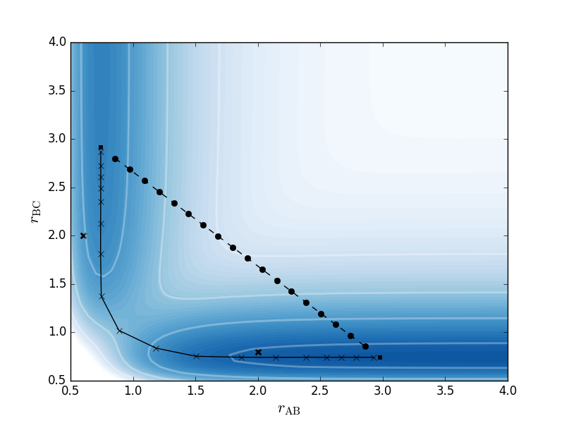

# NEB

## Background
This is a very basic python implementation of Nudged-Elastic Band in python based on the paper: [*"Improved tangent estimate in the nudged elastic band method for finding minimum energy paths and saddle points"*](http://dx.doi.org/10.1063/1.1323224) by Henkelmann et al.

## Usage
Usage should be quite straightforward with the additional python classes included but please check the `example.py` script in the root directory for a use-case of the [3-atom LEPS potential](http://theory.cm.utexas.edu/henkelman/pubs/jonsson98_385.pdf).
We also provide an example on how to use ORCA but it is very much provided *as is*.

Here, the two bold crosses are initial positions of two molecules.
They are minimized to a threshold shown as black squares.
A linear interpolated bath between the two (black circles) is then constructed and minimized using NEB (black cross with solid line).

### Philosophy behind this implementation
The basic design philosophy for this implementation is that one constructs a path (currently limited to a linear interpolation between two molecules) and then the nudge elastic band operates on that path.
